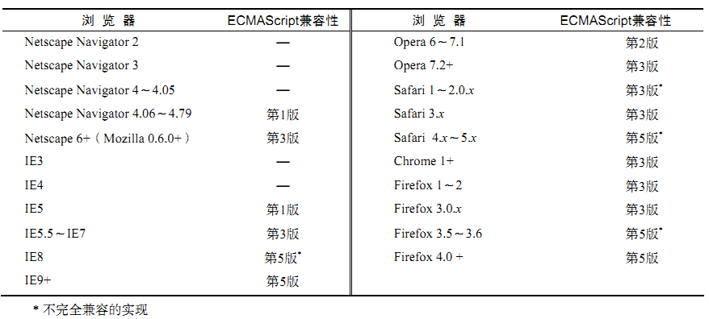

#ECMAScript标准
+ ECMA-262规范标准ECMAScript不包含输入和输出定义，仅作为构建脚本语言的基础，是对标准规定的各方面内容的**语言描述**
   + 语法
   + 类型
   + 语句
   + 关键字
   + 保留字
   + 操作符
   + 对象
+ ECMAScript与Web浏览器没有依赖关系，Web浏览器只是ECMAScript实现可能的**宿主环境之一**
   + 宿主环境提供基本的ECMAScript实现
   + 宿主环境同时也会提供该语言的扩展，以便语言与环境之间对接交互，如DOM
   + 常见的宿主环境：web浏览器、Node（服务端JavaScript平台）、Adobe Flash
   
# ECMAScript版本
+ ECMA-262第1版：删除JavaScript1.1中所有针对浏览器的代码，要求支持Unicode标准，对象实现与平台无关（如Date对象）
+ ECMA-262第2版：与ISO/IEC-16262保持严格一致，没有作任何新增、修改或删节处理
+ ECMA-262第3版：修改字符串处理、错误定义、数值输出和国际化标准；新增了对正则表达式、新控制语句、try-catch异常处理的支持。标志着ECMAScript 成为了一门真正的编程语言
+ ECMA-262第4版：修订后跨越太大，在正式发布前放弃
+ ECMA-262第5版：即ECMAScript3.1，澄清第3版中已知的歧义并增添了新的功能，包括原生JSON对象（用于解析和序列化JSON数据）、继承的方法和高级属性定义，另外还包含一种严格模式，对ECMAScript引擎解释和执行代码进行了补充说明

# ECMAScript兼容
+ 实现ECMAScript标准**必需做到**
   + 支持ECMA-262描述的所有“类型、值、对象、属性、函数以及程序句法和语义”
   + 支持Unicode字符标准
+ 实现ECMAScript标准**可以扩展**
   + 添加ECMA-262没有描述的“更多类型、值、对象、属性和函数”，主要是指该标准中没有规定的新对象和对象的新属性
   + 支持ECMA-262没有定义的“程序和正则表达式语法”，可以修改和扩展内置的正则表达式语法
   
# Web浏览器对ECMAScript的支持
