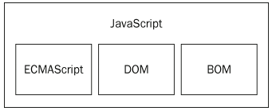
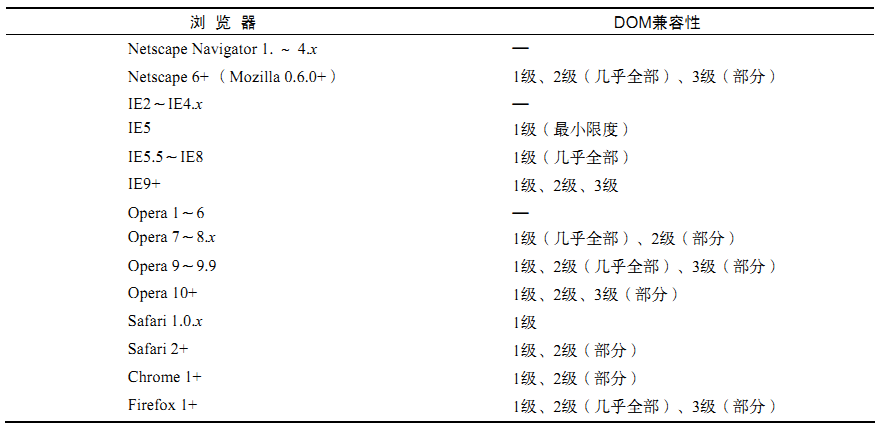

# JavaScript实现
+ 核心（ECMAScript）
+ 文档对象模型（DOM）
+ 浏览器对象模型（BOM）  

# [核心ECMAScript](ECMAScript标准.md) 【基础】

# 文档对象模型DOM 【扩展】
+ DOM的产生
   + DHTML技术允许无需重新加载网页，就可以修改其外观和内容，但Netscape和微软在开发DHTML方面不一致
   + 为了保持Web跨平台的特性，消除浏览器互不兼容的局面，W3C对DOM进行统一规划制定标准
+ 文档对象模型DOM是针对XML但经过扩展用于HTML的应用程序编程接口API
+ DOM把整个页面映射为一个多层节点结构的树形图，借助DOM提供的API，可以删除、添加、替换或修改任何节点
+ DOM标准
   + DOM0级：Internet Explorer 4.0和Netscape Navigator 4.0最初支持的DHTML
   + DOM1级：由两个模块组成：DOM核心（DOM Core）和DOM HTML
      + DOM核心规定的是如何映射基于XML的文档结构，以便简化对文档中任意部分的访问和操作
      + DOM HTML模块则在DOM核心的基础上加以扩展，添加了针对HTML的对象和方法
   + DOM2级：引入新模块，也给出了众多新类型和新接口的定义
      + DOM视图（DOM Views）：定义了跟踪不同文档（例如，应用CSS之前和之后的文档）视图的接口
      + DOM事件（DOM Events）：定义了事件和事件处理的接口
      + DOM样式（DOM Style）：定义了基于CSS为元素应用样式的接口
      + DOM遍历和范围（DOM Traversal and Range）：定义了遍历和操作文档树的接口
   + DOM3级：对DOM核心进行了扩展，并引入了新模块
      + 对DOM核心进行了扩展，开始支持XML 1.0规范，涉及XML Infoset、XPath和XML Base
      + DOM加载和保存（DOM Load and Save）：统一方式加载和保存文档的接口
      + DOM验证（DOM Validation）：验证文档的接口
   + DOM其他标准：
      + SVG（Scalable Vector Graphic，可伸缩矢量图）1.0
      + MathML（Mathematical Markup Language，数学标记语言）1.0
      + SMIL（Synchronized Multimedia Integration Language，同步多媒体集成语言）
+ 浏览器的DOM兼容性

# 浏览器对象模型BOM 【扩展】
+ BOM的出现是为了访问和操作浏览器窗口，即控制浏览器显示页面以外的部分
+ BOM作为JavaScript实现的一部分一直没有相关的标准，直到HTML5发布
+ BOM除了用来处理浏览器窗口和框架，还包括了一些扩展功能
   + 弹出新浏览器窗口的功能
   + 移动、缩放和关闭浏览器窗口的功能
   + 提供浏览器详细信息的navigator对象
   + 提供浏览器所加载页面的详细信息的location对象
   + 提供用户显示器分辨率详细信息的screen对象
   + 对cookies的支持
   + XMLHttpRequest和IE的ActiveXObject自定义对象

